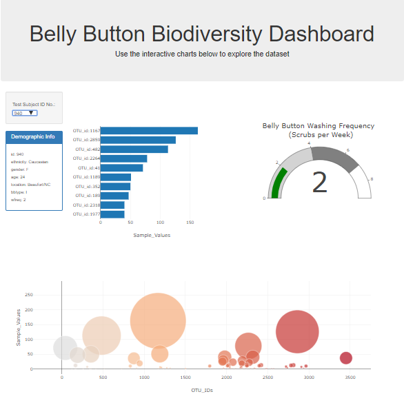

# Belly Button Biodiversity
**Plotly.js**, a **JavaScript** data visualization library, to create an interactive data visualization for the web.

## Stpes
•	Create basic plots with **Plotly**, including *bar charts, line charts, and pie charts*.  
•	Use **D3.json()** to fetch external data, such as **CSV** files and **web APIs**. 
•	Parse data in **JSON** format. 
•	Use *functional programming* in **JavaScript** to manipulate data. 
•	Use JavaScript’s Math library to manipulate numbers. 
•	Use *event handlers* in **JavaScript** to add interactivity to a data visualization. 
•	How to use interactivity to enhance your visualizations. 
•	Deploy an interactive chart to GitHub Pages. 

## Discussion
The codes are in [plots.js](https://github.com/plin2204/Plotly/blob/master/plots.js), and [index.html](https://github.com/plin2204/Plotly/blob/master/index.html).  

The [Link](https://plin2204.github.io/Plotly/) to the Website!

•	Create a *bar chart* of the top ten bacterial species in a volunteer’s navel. 
•	Create a *bubble chart* to visualize the relative frequency of all bacterial species in a volunteer’s navel. 
•	Complete the demographic information panel. 

